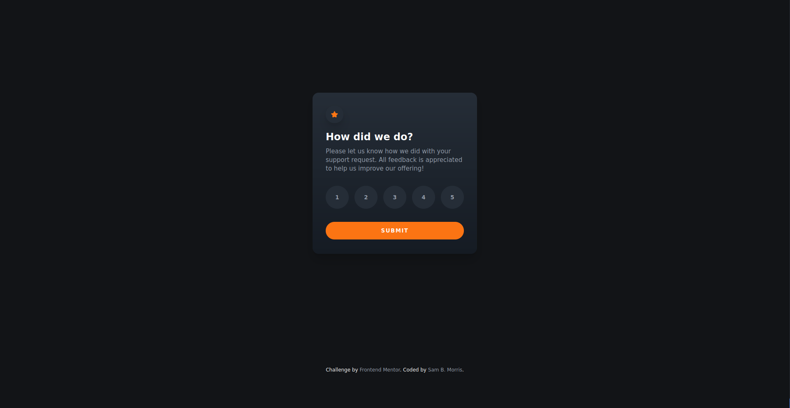

# interactiveRatingComponent - (Frontend Mentor)
## Challenge #003

## Welcome! 👋

This is a solution to the [Frontend Mentor](https://www.frontendmentor.io) This is my 3rd  User Interface (UI) component challenge.

## Table of contents

- [Overview](#overview)
  - [The challenge](#the-challenge)
- [My process](#my-process)
  - [Built with](#built-with)
  - [Useful resources](#useful-resources)
- [Author](#author)

## Overview

### The challenge

Users should be able to:

- View the optimal layout for the app depending on their device's screen size
- See hover states for all interactive elements on the page
- Select and submit a number rating
- See the "Thank you" card state after submitting a rating

## My process

### Built with

- Semantic HTML
- CSS
- CSS Grid
- Mobile-first workflow
- Vanilla JavaScript

## Author
### Sam B. Morris
- Codewars - [@divinestylus](www..com)
- Frontend Mentor - [@divinestylus](https://www.frontendmentor.io/profile/divinestylus)
- Twitter - [@divinestylus](https://www.twitter.com/divinestylus)